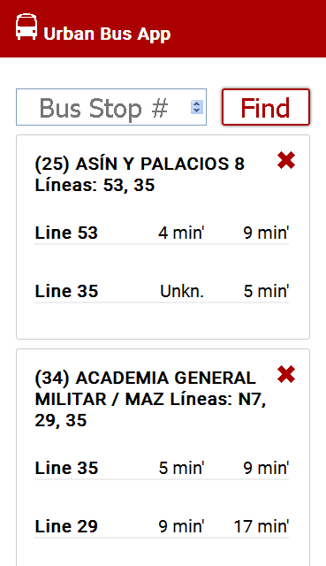
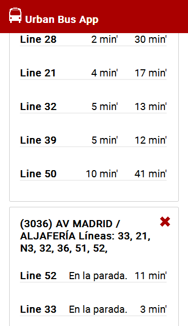

Urban Bus App
====================

Table of contents
---------------------

+ [Description](#description)
+ [Images](#images)
+ [Try It](#try-it)

Description
---------------------

Hi! I'm from Zaragoza (Spain) and i use to take the bus everyday. I need a lightweight app to predict where the bus is arriving to the bus stop. 

There are some apps that make this job, but they need to be downloaded and installed and they don't save the recent bus stops you entered. 

This app does. 

Images
---------------------

Try It
---------------------

You can test this app [here](https://miravete92.github.io/bus-app/)

Test bus stops: 3053, 56, 25, 34

API
---------------------

<http://www.zaragoza.es/api/recurso/urbanismo-infraestructuras/transporte-urbano/poste/tuzsa-3060.json>